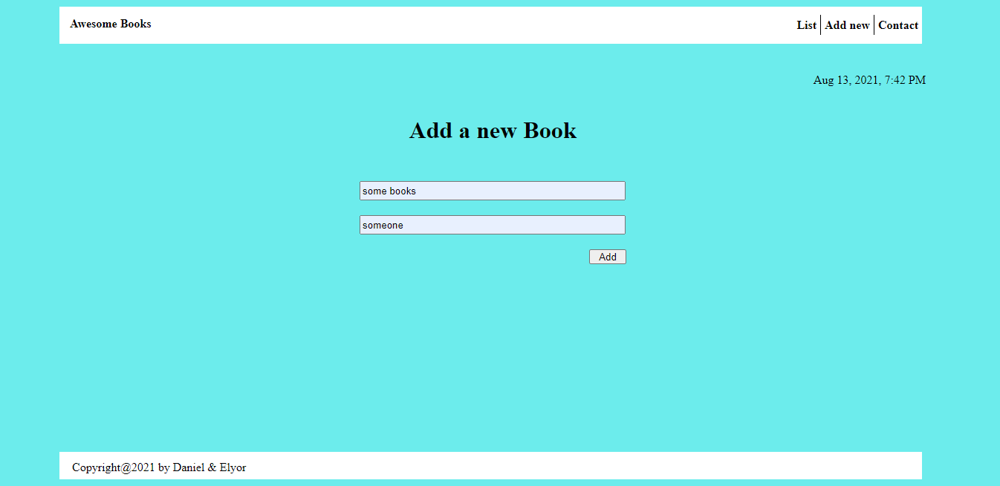

# Awesome-books

>Library website. User can add book with title and author and remove them.

## Built With

- Html,
- Css,
- Javascript

## Live Demo

[Awesome Books](https://rawcdn.githack.com/danmainah/Awesome-books/d821c125b55e58ee65e81ae8932b7515026f0025/index.html)

## How to use

- Clone it from ``https://github.com/danmainah/Awesome-books.git``

## Authors

👤 **Daniel Mainah**
- GitHub: [@danmainah](https://github.com/danmainah) 
- Twitter: [@Danmainah](https://twitter.com/dan_mainah) 
- LinkedIn: [@Daniel-Maina](www.linkedin.com/in/daniel-maina-315a38191) 

👤 **Elyor Doniyorov**
- Github: [@elyor-doniyorov](https://github.com/elyor-doniyorov)
- LinkedIn: [@elyor-doniyorov](www.linkedin.com/in/elyor-doniyorov)

## 🤝 Contributing

Contributions, issues, and feature requests are welcome!

Feel free to check the [issues page](https://github.com/danmainah/Awesome-books/issues/2).

## Show your support

Give a ⭐️ if you like this project!

## 📝 License

This project is [MIT](./LICENCE) licensed.